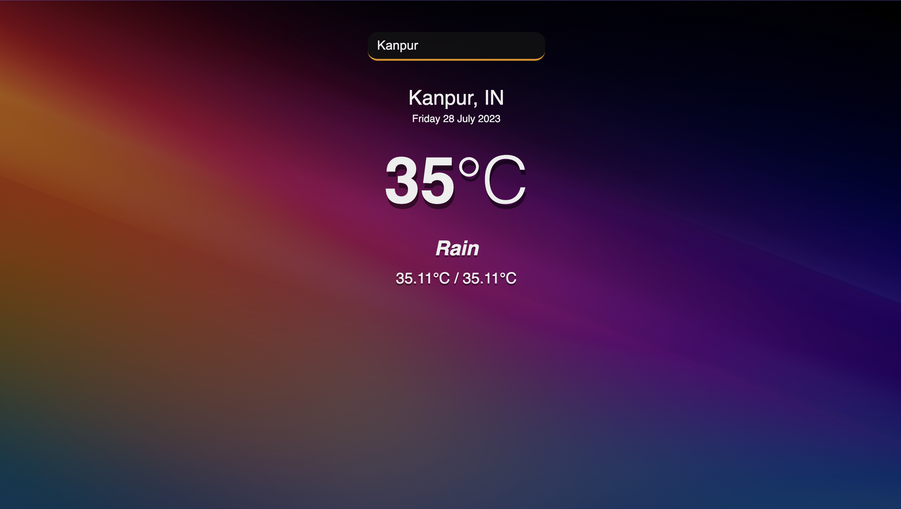

# Weather App

The Weather App is a simple web application that allows users to check the current weather information of any city. Users can enter the name of the city in the search box, and the app will display the city's current temperature, weather condition, and days high/low.

## Features

- Search for weather information by city name.
- Display the current temperature in Celsius.
- Show the weather condition (e.g., sunny, cloudy, rainy).
- Display the minimum and maximum temperature for the day.
- Display the current date.
## Technologies Used
- HTML
- CSS
- JavaScript
